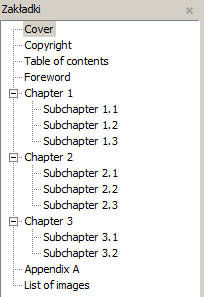

# pdf_bookmarks

pdf_bookmarks is a script which creates bookmarks in a PDF file from a simple text format.



## Pre-compiled executables

[here](https://github.com/kkthx/pdf_bookmarks/releases/latest) (windows only)

## Running GUI

`python pdf_bookmarks_gui.py`

## Running in console

`python pdf_bookmarks.py <input-pdf> <bookmarks-file> <output-pdf>`

## Bookmarks file format
```
First level page_num
<tab>First sublevel page_num
<tab><tab>First sub-sublevel page_num
<tab>Second sublevel page_num
Second level page_num
```
Example file is `example.txt`. Files are encoded in UTF-8.

## Testing

`python pdf_bookmarks_ut.py`

Script should produce two pdf files - input without bookmarks and output with bookmarks based on `example.txt`

## Dependencies

* Python 3
* PyPDF2
* Tkinter - for GUI

## Building standalone executable with PyInstaller

`pyinstaller --onefile --noconsole pdf_bookmarks_gui.py`

`pyinstaller --onefile pdf_bookmarks.py`

